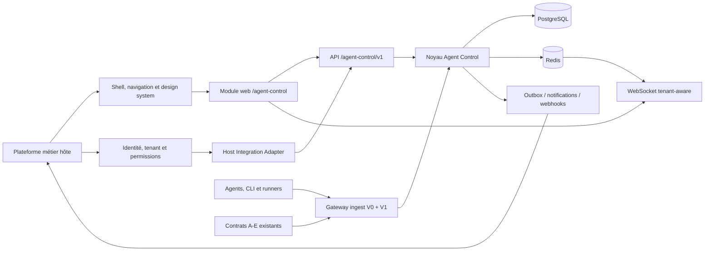
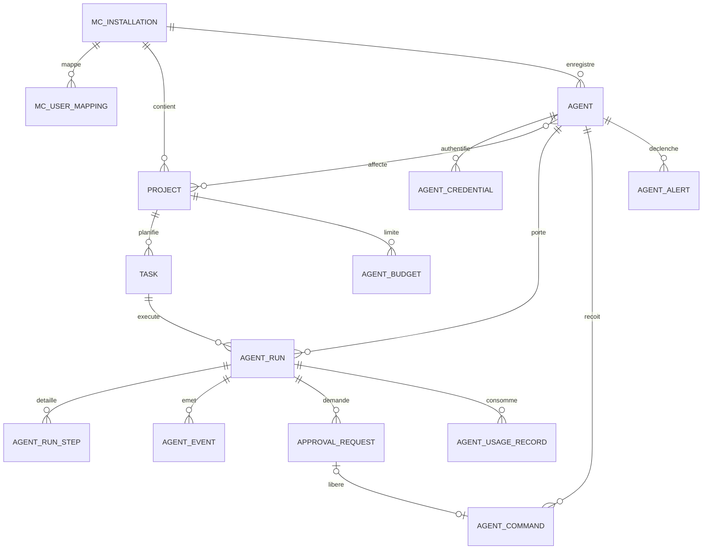

# Schéma de solution — Agent Control intégré à une plateforme métier

Statut : architecture cible, sans code  
Compatibilité : contrats Mission Control A–E conservés comme V0  
Nom fonctionnel du module : Agent Control

## 1. Mission du module

Agent Control est un module de gouvernance et de supervision d'agents IA intégré dans une plateforme métier existante. Il ne remplace ni l'authentification, ni la gestion des organisations, ni le shell de la plateforme. Il apporte :

- registre et identité des agents ;
- état temps réel et santé de la flotte ;
- projets, tâches, affectations et runs ;
- commandes opérateur et accusés de réception ;
- validation humaine des actions sensibles ;
- budgets, usage et coûts ;
- alertes, audit et reporting ;
- intégrations CLI, fichiers locaux, API et webhooks.

## 2. Hypothèses verrouillées

1. La plateforme hôte fournit l'utilisateur, le tenant, les rôles globaux, la langue, le fuseau et le design system.
2. Le module fonctionne en mode embarqué production et en mode autonome développement.
3. Le frontend est monté sous `/agent-control` ; l'API V1 sous `/agent-control/v1`.
4. Les contrats A–E restent accessibles pour les producteurs et écrans actuels durant la migration.
5. Le contexte tenant est résolu côté serveur, jamais accepté aveuglément depuis un body.
6. Les agents ont des credentials individuels, hashés, révocables, rotatifs et scopés.
7. Le contrat D avec secret global reste un mode de compatibilité désactivable en production.
8. Un heartbeat décrit un état courant ; un événement séquencé décrit un fait historique ; un run décrit une exécution bornée.
9. Les commandes sont asynchrones : l'agent les récupère, les accuse et publie leur résultat.
10. Les actions destructives ou à risque passent par une approbation humaine selon politique.
11. Le serveur fait foi pour états, permissions, budgets, transitions et agrégats.
12. PostgreSQL est la source de vérité ; Redis transporte les événements mais ne remplace pas la persistance.

## 3. Architecture logique

## 4. Ports d'intégration hôte

Le domaine ne dépend pas directement des tables de la plateforme hôte. Il consomme des interfaces :

### `HostIdentityPort`

- valider un JWT/session hôte ;
- retourner `external_user_id`, email affichable, nom, statut ;
- ne jamais recopier mot de passe ou secret SSO.

### `HostTenantPort`

- résoudre `external_tenant_id` et tenant actif ;
- vérifier que l'utilisateur appartient au tenant ;
- fournir nom, slug, statut et feature flags.

### `HostPermissionPort`

- traduire les permissions hôte vers les capacités du module ;
- capacités minimales : `view`, `operate`, `manage_agents`, `manage_projects`, `approve`, `view_costs`, `admin` ;
- l'UI peut masquer une action, mais l'API vérifie toujours.

### `HostNavigationPort`

- enregistrer le module, ses routes et badges ;
- ouvrir une route du module dans le shell existant ;
- ne pas dupliquer topbar, profil, langue ou logout.

### `HostNotificationPort`

- envoyer notification in-app/email vers l'infrastructure hôte ;
- recevoir un identifiant idempotent ;
- retenter sans dupliquer.

### Adaptateur local

En développement, ces ports réutilisent `User`, `company_id`, le JWT local, le RBAC existant et les composants Shell. L'adaptateur est sélectionné par configuration, pas par branches métier dispersées.

## 5. Capacités et rôles du module

| Profil | Capacités |
|---|---|
| Observateur | dashboard, agents, projets, runs et audit en lecture |
| Opérateur | observateur + acquitter alerte, relancer, pause/reprise/cancel autorisés |
| Responsable projet | opérateur + CRUD projet/tâche, affectation et priorités |
| Approbateur | lecture + décision sur demandes d'approbation assignées |
| Responsable coûts | lecture usage, budgets, exports et alertes budget |
| Administrateur module | registre agents, credentials, politiques, intégrations et toutes capacités |

Ces profils sont des mappings de permissions, pas une nouvelle hiérarchie globale imposée à la plateforme hôte.

## 6. Domaines fonctionnels

### 6.1 Registre d'agents

- création et enregistrement ;
- type/runtime/provider/version ;
- capacités, outils autorisés, environnement et propriétaire ;
- credential initial affiché une seule fois ;
- rotation, révocation, suspension et archivage ;
- association à un tenant, des projets et politiques ;
- présence, état, dernière activité et version du client.

### 6.2 Orchestration

- projets réels en DB ;
- tâches et sous-tâches, priorité, dépendances et critères d'acceptation ;
- affectation à un ou plusieurs agents ;
- run borné avec objectif, état, timestamps et résultat ;
- étapes/tool calls avec durée, statut et résumé ;
- blocage, retry, annulation, reprise et clôture ;
- liens vers branche, commit, PR, artefacts et logs externes.

### 6.3 Contrôle humain

- politiques par tenant/projet/agent/action ;
- demande d'approbation structurée ;
- contexte, impact, expiration et approbateurs ;
- décision `approved|rejected|expired|cancelled` avec commentaire ;
- commande libérée seulement après décision valide ;
- audit immuable.

### 6.4 Pilotage et coûts

- tokens entrée/sortie/cache, appels outils, durée, modèle et fournisseur ;
- coût normalisé dans une devise de référence ;
- budget tenant/projet/agent/période ;
- alertes seuil 50/80/100 % configurables ;
- tableaux par période, agent, projet, modèle et état ;
- export CSV borné et audité.

## 7. Modèle de données cible

Les tables existantes restent présentes. Les changements qui étendent Contract A doivent être documentés dans un nouveau contrat versionné et couverts par des tests de compatibilité.

### Tables existantes consolidées

#### `users`

Conservée pour le mode local. En mode hôte, l'identité externe est associée via une installation/mapping et le module ne gère pas les mots de passe.

#### `projects`

Conserver les champs actuels et ajouter de manière additive : `external_ref`, `owner_user_ref`, `environment`, `archived_at`. `company_id` devient obligatoire pour les nouvelles données V1, tout en restant nullable pour la compatibilité V0.

#### `agents`

Conserver `agent_key` global pour le contrat D. Ajouter :

- `company_id`, `display_name`, `description` ;
- `runtime`, `provider`, `client_version`, `environment` ;
- `capabilities` JSONB validé, `status` registre (`active|suspended|revoked|archived`) ;
- `registered_by`, `registered_at`, `revoked_at` ;
- `last_sequence` pour rejeter les événements anciens V1.

Pour V1, `agent_key` reste global et est généré sous la forme `<installation_key>:<local_key>` afin de ne pas casser l'unicité de Contract A.

#### `tasks`

Étendre avec : `parent_id`, `description`, `priority`, `progress`, `position`, `acceptance_criteria`, `due_at`, `started_at`, `completed_at`, `updated_at`, `archived_at`. Le statut devient un ensemble validé tout en gardant une lecture compatible des valeurs historiques.

#### `activity_logs`

Conserver comme journal de compatibilité. Les événements V1 riches vont dans une table dédiée et peuvent projeter un résumé ici si nécessaire.

### Nouvelles tables

#### `mc_installations`

- installation du module dans un tenant hôte ;
- `id`, `external_tenant_id`, `installation_key`, `status`, `settings`, `feature_flags` ;
- adaptateur hôte sélectionné, timestamps, archivage ;
- unique par couple plateforme/tenant.

#### `mc_user_mappings`

- `installation_id`, `external_user_id`, `local_user_id` nullable ;
- cache minimal de profil affichable ;
- unique `(installation_id, external_user_id)`.

#### `agent_credentials`

- `id`, `agent_id`, `key_prefix`, `secret_hash`, `scopes` ;
- `expires_at`, `last_used_at`, `revoked_at`, `created_by` ;
- le secret brut n'est renvoyé qu'à la création/rotation.

#### `agent_project_assignments`

- association agent↔projet avec rôle, dates, capacité et statut ;
- unique sur affectation active.

#### `agent_runs`

- `id`, `company_id`, `project_id`, `task_id`, `agent_id` ;
- `external_run_key`, `objective`, `state` ;
- `started_at`, `finished_at`, `heartbeat_at` ;
- `result_summary`, `error_code`, `error_message`, `metadata` ;
- version optimiste et contrainte de transition.

#### `agent_run_steps`

- `id`, `run_id`, `sequence`, `step_type`, `name`, `state` ;
- `started_at`, `finished_at`, `duration_ms` ;
- `input_summary`, `output_summary`, `tool_name`, `metadata` ;
- unique `(run_id, sequence)` ;
- pas de prompt ou secret brut par défaut.

#### `agent_events`

- journal append-only des événements V1 ;
- `id`, `company_id`, `agent_id`, `run_id`, `sequence`, `event_type` ;
- `payload`, `occurred_at`, `received_at`, `request_id` ;
- unicité/idempotence par producteur et séquence.

#### `agent_commands`

- `id`, `company_id`, `agent_id`, `run_id`, `command_type` ;
- `payload`, `status` (`queued|delivered|acknowledged|succeeded|failed|expired|cancelled`) ;
- `requested_by`, `approval_request_id`, `expires_at` ;
- timestamps de livraison, ACK et résultat ;
- clé d'idempotence unique par tenant.

#### `approval_requests`

- `id`, `company_id`, `project_id`, `task_id`, `run_id`, `agent_id` ;
- `action_type`, `risk_level`, `title`, `context`, `requested_by_agent` ;
- `status`, `assigned_to`, `expires_at`, `decided_at`, `decision_by`, `decision_comment` ;
- version optimiste pour empêcher une double décision.

#### `agent_policies`

- portée tenant/projet/agent ;
- action ou outil ciblé, effet `allow|deny|require_approval` ;
- conditions JSONB validées, priorité, statut et version ;
- évaluation déterministe et auditée.

#### `agent_usage_records`

- `company_id`, `agent_id`, `project_id`, `run_id` ;
- provider, modèle, tokens, appels, durée, quantité, devise, coût décimal ;
- `occurred_at`, `source_event_id`, `pricing_version` ;
- aucune utilisation de float pour l'argent.

#### `agent_budgets`

- portée et période ; montant, devise, seuils, consommation projetée ;
- comportement au dépassement `alert|require_approval|block_new_runs`.

#### `agent_alerts`

- type, sévérité, statut, entité cible et déduplication ;
- ouverture, acquittement, résolution, acteur et timestamps.

#### `mc_audit_logs`

- journal métier append-only tenant-aware ;
- acteur humain ou agent, action, cible, avant/après redacted, IP hashée, request_id ;
- politique de rétention explicite.

#### `mc_outbox_events`

- événements à publier après commit ;
- statut, tentatives, prochaine tentative et erreur ;
- permet Redis, notifications et webhooks fiables sans double effet.

### Relations majeures

## 8. Contrats API

### Compatibilité V0

Conserver sans modification incompatible :

- `/auth/*`, `/projects`, `/agents`, `/stats/dashboard` ;
- `POST /agents/heartbeat` Contract D ;
- `/ws` et événements Contract E ;
- CLI `mc-platform` et fichiers status.

Les corrections de dérive doivent préserver les anciens champs ou utiliser des adaptateurs de réponse.

### Contexte hôte V1

- `GET /agent-control/v1/context` ;
- `GET /agent-control/v1/capabilities` ;
- `GET /agent-control/v1/health` ;
- `POST /agent-control/v1/installations/{id}/activate` réservé admin.

### Registre

- `GET|POST /agent-control/v1/agents` ;
- `GET|PATCH /agent-control/v1/agents/{id}` ;
- `POST /agent-control/v1/agents/{id}/credentials` ;
- `POST /agent-control/v1/agents/{id}/credentials/{credential_id}/rotate` ;
- `DELETE /agent-control/v1/agents/{id}/credentials/{credential_id}` ;
- `POST /agent-control/v1/agents/{id}/suspend|resume|archive` ;
- `GET /agent-control/v1/agents/{id}/health`.

### Ingest V1

- `POST /agent-control/v1/ingest/events` — batch borné, séquencé et idempotent ;
- `POST /agent-control/v1/ingest/heartbeat` — état courant tenant-aware ;
- `GET /agent-control/v1/agent/commands` — long poll borné ;
- `POST /agent-control/v1/agent/commands/{id}/ack` ;
- `POST /agent-control/v1/agent/commands/{id}/result`.

L'authentification de ces routes utilise le credential agent, pas le JWT utilisateur.

### Projets, tâches et runs

- `GET|POST /agent-control/v1/projects` ;
- `GET|PATCH|DELETE /agent-control/v1/projects/{id}` ;
- `GET|POST /agent-control/v1/projects/{id}/tasks` ;
- `GET|PATCH /agent-control/v1/tasks/{id}` ;
- `POST /agent-control/v1/tasks/{id}/assign` ;
- `GET /agent-control/v1/runs` ;
- `GET /agent-control/v1/runs/{id}` ;
- `GET /agent-control/v1/runs/{id}/timeline` ;
- `POST /agent-control/v1/runs/{id}/commands`.

### Approbations, politiques et alertes

- `GET /agent-control/v1/approvals` ;
- `GET /agent-control/v1/approvals/{id}` ;
- `POST /agent-control/v1/approvals/{id}/approve|reject` ;
- `GET|POST /agent-control/v1/policies` ;
- `PATCH|DELETE /agent-control/v1/policies/{id}` ;
- `GET /agent-control/v1/alerts` ;
- `POST /agent-control/v1/alerts/{id}/acknowledge|resolve`.

### Coûts, reporting et audit

- `GET /agent-control/v1/dashboard` ;
- `GET /agent-control/v1/usage` ;
- `GET|POST /agent-control/v1/budgets` ;
- `PATCH /agent-control/v1/budgets/{id}` ;
- `GET /agent-control/v1/reports/export.csv` ;
- `GET /agent-control/v1/audit`.

Toutes les listes ont pagination par curseur, ordre stable, filtres bornés et limites maximales.

## 9. Enveloppes et transitions

### Événement agent V1

Champs obligatoires : `event_id`, `agent_key`, `sequence`, `event_type`, `occurred_at`, `payload`. Champs contextuels : `run_id`, `project_id`, `task_id`, `trace_id`, `client_version`.

Le serveur :

- authentifie le credential et dérive tenant/agent ;
- refuse un `agent_key` différent de l'identité ;
- déduplique `event_id` ;
- rejette ou ignore proprement une séquence ancienne ;
- persiste avant publication ;
- ne permet pas au payload de changer son tenant.

### Run

`queued → starting → running → waiting_approval|blocked → running → succeeded|failed|cancelled|timed_out`

Les états terminaux sont immuables. Retry crée un nouveau run lié au précédent, au lieu de réouvrir un run terminal.

### Commande

`queued → delivered → acknowledged → succeeded|failed`  
`queued|delivered → expired|cancelled`

Une commande risquée reste `queued` avec `approval_request_id` jusqu'à approbation.

### Approbation

`pending → approved|rejected|expired|cancelled`

Une décision utilise une version optimiste et est définitive. Le commentaire et l'acteur sont audités.

## 10. Temps réel V1

- endpoint `/agent-control/ws?token=<host-jwt>&installation_id=<uuid>` ;
- validation identité, tenant et capacité avant acceptation ;
- souscriptions autorisées : `fleet`, `project:{id}`, `agent:{id}`, `run:{id}`, `approvals` ;
- le serveur vérifie chaque topic ; le client ne choisit jamais un tenant arbitraire ;
- message : `id`, `type`, `tenant_id`, `sequence`, `data`, `occurred_at` ;
- reprise via `last_event_id` ou refresh HTTP si trou ;
- heartbeat WS, backoff avec jitter, fallback polling ;
- outbox DB → Redis → fan-out ; Redis indisponible ne perd pas le fait métier.

## 11. Frontend embarquable

### Routes

- `/agent-control` — synthèse ;
- `/agent-control/agents` et `/agents/[id]` ;
- `/agent-control/projects` et `/projects/[id]` ;
- `/agent-control/runs` et `/runs/[id]` ;
- `/agent-control/approvals` ;
- `/agent-control/alerts` ;
- `/agent-control/costs` ;
- `/agent-control/audit` ;
- `/agent-control/settings`.

### Structure

- route segment indépendant, hors du grand `app/page.tsx` ;
- `AgentControlProvider` reçoit identité, installation, permissions, locale et navigation hôte ;
- client API unique et types OpenAPI générés ;
- React Query pour état serveur ; Zustand seulement pour préférences locales ;
- aucun compteur depuis `mc-data.ts` ;
- composants actuels réutilisés après suppression de leurs dépendances mock ;
- design tokens du host prioritaires, thème local en fallback ;
- i18n centralisée `fr/en/ar`, RTL et accessibilité.

### Vues fonctionnelles

- dashboard : santé, agents actifs/bloqués/stale, runs, validations, budget ;
- agents : filtre, santé, capacités, credentials et affectations ;
- projet : tâches réelles, agents, runs, risques, Git ;
- run : timeline d'événements/étapes, coût, logs redacted, commandes ;
- validations : file, contexte, impact, décision ;
- alertes : sévérité, déduplication, ACK/résolution ;
- coûts : période, budget et ventilation ;
- audit : recherche bornée et export.

## 12. Sécurité

- isolation tenant dans chaque service et requête ;
- credential agent hashé, scopes, expiration, rotation et révocation ;
- JWT hôte validé par adaptateur avec audience/issuer configurés ;
- rate limits distincts auth, ingest, commandes et exports ;
- idempotence et séquence contre les replays ;
- politique fail-closed pour permissions et actions sensibles ;
- logs et événements redacted ;
- aucun prompt, secret, token ou output sensible brut par défaut ;
- CSP, CORS exact, headers et cookies selon le host ;
- audit des credentials, rôles, commandes, décisions, exports et budgets ;
- rétention configurable et purge tenant-aware ;
- tests cross-tenant négatifs sur HTTP, WS, export, cache et événements.

## 13. Déploiement et configuration

Nouvelles variables proposées :

- `MC_MODULE_MODE=standalone|embedded` ;
- `MC_MODULE_BASE_PATH=/agent-control` ;
- `MC_HOST_ADAPTER=local|jwt` ;
- `MC_HOST_JWT_ISSUER`, `MC_HOST_JWT_AUDIENCE`, `MC_HOST_JWKS_URL` ;
- `MC_COMPAT_V0_ENABLED=1` ;
- `MC_FILE_SYNC_ENABLED=0` en production embarquée ;
- `MC_GLOBAL_INGEST_ENABLED=0` après migration ;
- `MC_EVENT_RETENTION_DAYS`, `MC_AUDIT_RETENTION_DAYS` ;
- `MC_DEFAULT_CURRENCY` ;
- `MC_EVENT_BATCH_MAX`, `MC_COMMAND_LONG_POLL_SECONDS`.

Les secrets n'utilisent jamais `NEXT_PUBLIC_`. Toute valeur de développement dangereuse provoque un échec au démarrage en environnement production.

## 14. Plan de build

### P0 — Contrats et baseline

- capturer OpenAPI et événements réellement servis ;
- documenter les dérives sans les casser ;
- écrire `CONTRACTS_AGENT_CONTROL_V1.md` ;
- ajouter tests de compatibilité V0 ;
- établir la matrice capacités×actions.

Gate : formes V0 gelées par tests, aucune régression existante.

### P1 — Intégration hôte et tenancy

- ports/adaptateurs hôte et adaptateur local ;
- installation, mapping utilisateur, contexte courant ;
- filtrage tenant dans services/queries ;
- nouvelle route `/agent-control/v1/context` ;
- tests cross-tenant systématiques.

Gate : deux tenants simultanés, aucune fuite HTTP/WS/cache.

### P2 — Source de vérité DB

- remplacer `project_seed` par seed DB uniquement en mode démo ;
- rendre tâches/sous-tâches persistantes ;
- supprimer usages runtime de `mc-data.ts` ;
- générer types TS depuis OpenAPI ;
- conserver l'affichage existant avec données réelles.

Gate : chaque KPI et compteur provient de PostgreSQL/API.

### P3 — Registre et ingest sécurisé

- métadonnées registre et credentials par agent ;
- rotation/révocation/scopes ;
- ingest V1 batch, événements, séquences, idempotence ;
- compatibilité Contract D via adaptateur ;
- conflit fichier/API résolu par règle de source.

Gate : un credential révoqué est refusé immédiatement et ne peut agir pour un autre agent/tenant.

### P4 — Tâches, runs et timeline

- modèle tâche complet et affectations ;
- runs, étapes et événements ;
- transitions serveur et retry par nouveau run ;
- pages projet/run et timeline ;
- lien Git/artefacts.

Gate : un run complet est reconstituable et auditable depuis la DB.

### P5 — Commandes, approbations et politiques

- file de commandes, long poll, ACK et résultat ;
- politiques allow/deny/require approval ;
- demandes et décisions humaines ;
- UI opérateur et approbateur ;
- expiration, concurrence et audit.

Gate : aucune commande risquée n'est livrée sans décision valide.

### P6 — Coûts, alertes et observabilité

- usage normalisé, tarifs versionnés, budgets ;
- alertes persistées/dédupliquées ;
- dashboards coûts/santé ;
- logs structurés, métriques, traces et outbox ;
- runbooks et rétention.

Gate : coûts réconciliables et alertes opérables sans données sensibles.

### P7 — Frontend embarqué et release

- route segment `/agent-control` et provider hôte ;
- navigation/design/i18n intégrés ;
- suppression du shell dupliqué en mode embedded ;
- E2E, accessibilité, responsive, RTL ;
- migration, feature flag, canary et rollback.

Gate : activation par tenant sans impact sur le reste de la plateforme.

## 15. Définition de terminé

- contrats A–E compatibles et contrat V1 documenté ;
- plateforme hôte seule propriétaire de l'identité et du tenant ;
- 100 % des données d'affichage viennent de l'API ;
- agents authentifiés individuellement et révocables ;
- tâches, runs, étapes, commandes et approbations persistés ;
- budgets, coûts, alertes et audit utilisables ;
- HTTP, WebSocket, cache et exports isolés par tenant ;
- types TS générés et aucun `@ts-nocheck` dans le module ;
- tests unitaires, intégration, concurrence, contrat et E2E au vert ;
- mode embedded activable par feature flag et rollback documenté ;
- `ruff check apps`, `pytest -q`, lint et build web passent ;
- synchronisation fichiers et secret global désactivés en production après migration.

