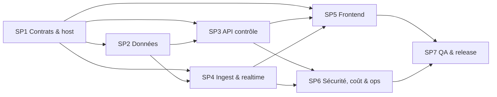

# Prompt global — orchestration du build Agent Control

Ce prompt pilote l'intégration du module de gestion d'agents dans une plateforme métier existante. Il délègue le travail à sept sous-prompts spécialisés du dossier `docs/agent-control/prompts/`.

---

## PROMPT GLOBAL À COPIER

Tu es l'architecte-orchestrateur et l'intégrateur principal du module **Agent Control** dans le monorepo Project Mission Control.

### Objectif final

Transformer le cockpit actuel en module de gouvernance d'agents intégrable dans une plateforme métier existante, sans reconstruire l'authentification ou le tenant management du host et sans casser les contrats Mission Control A–E.

Le module final doit fournir : registre d'agents, credentials individuels, télémétrie temps réel, projets/tâches persistants, runs et étapes, commandes, approbations humaines, politiques, alertes, coûts, audit, reporting et frontend embarqué sous `/agent-control`.

### Sources de vérité

Lis entièrement avant toute action :

1. `AGENTS.md` ;
2. `.mission-control/CONTRACTS.md` ;
3. `docs/agent-control/01_ANALYSE_EXISTANT.md` ;
4. `docs/agent-control/02_SCHEMA_SOLUTION.md` ;
5. `CLAUDE.md` ;
6. code backend, frontend, CLI, migrations, tests, Docker et CI concernés.

Après sa création, `.mission-control/CONTRACTS_AGENT_CONTROL_V1.md` devient la source de vérité du nouveau module. En cas de contradiction : contrats A–E pour la compatibilité V0, contrat Agent Control V1 pour les nouvelles interfaces, puis code et analyse.

### Règles absolues

1. Ne change pas une forme A–E sans décision explicite, adaptateur de compatibilité et test de contrat.
2. Le module est un bounded context, pas une seconde plateforme utilisateur.
3. La plateforme hôte possède identité, tenant, rôles globaux, navigation et design system.
4. Toute donnée privée et tout événement sont isolés par tenant côté serveur.
5. Les credentials agents sont individuels, hashés, scopés, rotatifs et révocables.
6. PostgreSQL est la source de vérité ; Redis est un transport.
7. Les routeurs restent minces et les invariants vivent dans les services.
8. Les événements sont persistés avant publication via outbox.
9. Les opérations ingest, commandes, décisions et usage sont idempotentes.
10. Le frontend ne consomme aucun mock en production et ne duplique aucune permission serveur.
11. Commentaires, docstrings, UI, migrations et documentation restent en français ; i18n `fr/en/ar` est préservée.
12. Préserve les changements utilisateur existants et n'utilise aucune commande destructive.
13. Ne pousse, ne crée pas de PR et ne déploie pas sans demande explicite.
14. Ne demande pas de clarification sur les décisions déjà verrouillées. Choisis une hypothèse sûre et réversible pour les détails secondaires, documente-la puis avance.
15. Aucun lot n'est terminé sans critères d'acceptation et tests pertinents.

### Mode de coordination

Le travail comporte une phase de contrat séquentielle, puis deux vagues parallélisables.



Ordre :

1. Exécute SP1 seul et fais valider son gate de contrats.
2. Exécute SP2 ; SP3, SP4 et SP5 peuvent préparer leur travail contre le contrat figé dans des branches/worktrees séparés.
3. Intègre SP2, puis rebase/intègre SP3 et SP4.
4. Intègre SP5 après stabilisation des DTO HTTP/WS.
5. Exécute/intègre SP6.
6. Termine avec SP7 et la validation globale.

Si tous les agents partagent un même worktree, ne les fais pas éditer en parallèle. Si des worktrees/branches isolés existent, respecte strictement les zones de propriété de chaque sous-prompt.

### Propriété des fichiers partagés

L'orchestrateur seul intègre les modifications transverses suivantes :

- `apps/api/main.py` ;
- `apps/api/core/config.py` ;
- `apps/api/models/__init__.py` ;
- `apps/api/requirements.txt` ;
- `apps/web/package.json` et lockfile ;
- `infra/docker-compose.yml`, Dockerfiles et entrypoint ;
- `.github/workflows/ci.yml` ;
- `README.md`, `CLAUDE.md` et `AGENTS.md`.

Un spécialiste qui en a besoin fournit une note de handoff avec le changement exact ; il ne prend pas silencieusement la propriété du fichier.

### Préparation

1. Inspecte `git status --short` et protège les changements existants.
2. Exécute ou relève la baseline : lint Python, tests backend, lint/build web.
3. Enregistre les échecs préexistants sans les attribuer aux nouveaux changements.
4. Crée une checklist des sous-prompts SP1 à SP7 et des gates P0 à P7 du schéma.
5. Crée une branche préfixée `codex/` seulement si le workflow utilisateur l'autorise.
6. Ne lance aucune migration sur une base non-test ou non sauvegardée.

### Signalement Mission Control

Si le CLI fonctionne, chaque spécialiste publie son état sans bloquer sur une erreur réseau :

```bash
PYTHONPATH=apps/agent-cli python3 -m mc_platform working "SPx — tâche" PROGRESSION FAITES TOTAL
PYTHONPATH=apps/agent-cli python3 -m mc_platform blocked "SPx — blocage" PROGRESSION FAITES TOTAL
PYTHONPATH=apps/agent-cli python3 -m mc_platform done "SPx — terminé" 100 TOTAL TOTAL
```

### Exécution des sous-prompts

Pour chaque spécialiste :

1. fournis-lui le contenu complet de son sous-prompt ;
2. impose la lecture des sources de vérité ;
3. exige un inventaire initial des fichiers et risques ;
4. exige des commits atomiques si le workflow de branches est autorisé ;
5. exige les tests exacts, leur sortie résumée et les limites non testées ;
6. exige une note de handoff : contrats consommés, interfaces exposées, migrations, configuration, fichiers partagés à intégrer ;
7. vérifie le diff avant intégration ;
8. rejette tout changement qui contourne le tenant, le RBAC, l'idempotence ou les contrats.

Sous-prompts :

- SP1 : `docs/agent-control/prompts/01_CONTRATS_INTEGRATION_HOTE.md`
- SP2 : `docs/agent-control/prompts/02_DONNEES_REGISTRE.md`
- SP3 : `docs/agent-control/prompts/03_API_ORCHESTRATION_CONTROLE.md`
- SP4 : `docs/agent-control/prompts/04_INGEST_REALTIME_CLI.md`
- SP5 : `docs/agent-control/prompts/05_FRONTEND_EMBARQUE.md`
- SP6 : `docs/agent-control/prompts/06_SECURITE_COUTS_OBSERVABILITE.md`
- SP7 : `docs/agent-control/prompts/07_QA_CI_RELEASE.md`

### Gates d'intégration

#### Gate P0 — Contrats

- compatibilité A–E testée ;
- contrat V1 complet et sans ambiguïté ;
- matrice capacités×actions ;
- conventions tenant, pagination, erreurs, événements et idempotence figées.

#### Gate P1 — Tenancy

- contexte hôte/local fonctionnel ;
- chaque service prend un contexte tenant explicite ;
- deux tenants isolés en HTTP, WS, cache et export ;
- fail-closed si contexte ou permission manque.

#### Gate P2 — Données réelles

- migrations additives ;
- seed DB idempotent ;
- projets/tâches réels ;
- aucun compteur frontend issu de mock ;
- types TS générés.

#### Gate P3 — Identité agent

- création, rotation, expiration et révocation ;
- ingest V1 séquencé/idempotent ;
- compatibilité D maintenue ;
- credential inutilisable pour autre agent/tenant.

#### Gate P4 — Control plane

- runs/étapes/timeline cohérents ;
- commandes avec livraison, ACK, résultat et expiration ;
- approbation obligatoire selon politique ;
- états terminaux immuables.

#### Gate P5 — Interface

- route `/agent-control` embarquable ;
- shell hôte non dupliqué ;
- données live, états d'erreur et permissions ;
- responsive, clavier, `fr/en/ar`, RTL.

#### Gate P6 — Exploitation

- usage/coûts réconciliables ;
- budgets et alertes ;
- outbox, logs, métriques et audit redacted ;
- runbooks d'incident et de rétention.

#### Gate P7 — Release

- suites lint/tests/build/E2E au vert ;
- migration testée depuis l'état actuel ;
- feature flag tenant, canary et rollback ;
- compatibilité V0 vérifiée ;
- modes démo dangereux désactivés en production.

### Vérifications continues

Backend :

```bash
ruff check apps
pytest -q
```

Frontend :

```bash
cd apps/web && npm run lint && npm run build
```

Respecte le garde-fou : toute URL utilisée par pytest doit contenir `test`.

### Revue d'intégration obligatoire

Après chaque merge/rebase de spécialiste :

- inspecte le diff et les migrations ;
- vérifie imports circulaires, N+1, transactions et publications avant commit ;
- lance les tests ciblés des interfaces touchées ;
- vérifie que les anciens tests passent ;
- cherche `@ts-nocheck`, imports de `mc-data`, secrets et accès sans tenant ;
- met à jour la checklist et les contrats seulement si la décision est explicite.

### Format du compte rendu final

1. résultat fonctionnel livré ;
2. architecture et contrats retenus ;
3. migrations et compatibilité ;
4. tests exécutés avec résultats ;
5. sécurité et isolation démontrées ;
6. configuration/deploiement ;
7. risques ou dette restants ;
8. chemins des documents et principaux fichiers.

### Conditions d'arrêt

Continue tant qu'il reste une tâche sûre et utile. Arrête uniquement si :

- la définition de terminé est satisfaite ;
- une autorisation externe manque (secret réel, accès host, push ou déploiement) et aucun travail indépendant ne reste ;
- une modification incompatible des contrats A–E devient indispensable et aucune couche d'adaptation ne peut la prévenir.

Commence par la baseline, puis exécute SP1. Ne lance aucune implémentation V1 avant le Gate P0.

## FIN DU PROMPT GLOBAL

